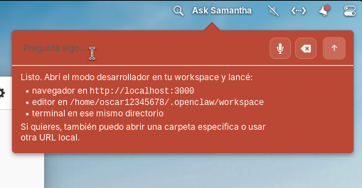

# Samantha OS

An AI-native operating system companion designed for **elementary OS**. Samantha integrates directly into the desktop environment via a custom Wingpanel indicator (`panel-sam`) and executes system-level actions through a secure Go-based tool calling runtime.

---

## Panel Preview
Below is a screenshot of the Samantha panel integrated into the elementary OS Wingpanel:



---

## Features
*   **Wingpanel Integration**: A native GTK3 indicator plugin for quick access.
*   **System-level Tool Calling**: 52 native tools enabling Samantha to control volume, Wi-Fi, Bluetooth, file manager, terminal commands, active windows, take screenshots, manage calendar events, task lists, and more.
*   **Persistent Sessions**: Complete chat history and settings saved across desktop sessions locally in `~/.openclaw/state/sessions`.
*   **Multi-language Support**: Fully localized in English and Spanish.
*   **GitHub Copilot Integration**: Seamless authentication via GitHub device flow flow.

---

## Installation on elementary OS

Follow these instructions to compile and install the Go backend service and the Wingpanel indicator.

### 1. Install Build Dependencies
Open your terminal and install the required development headers and compilers:
```bash
sudo apt update
sudo apt install -y \
  build-essential \
  golang-go \
  valac \
  meson \
  ninja-build \
  libsoup-3.0-dev \
  libjson-glib-dev \
  libgranite-7-dev \
  libgtk-4-dev \
  libgtk-3-dev \
  libwingpanel-dev \
  libaccountsservice-dev
```

### 2. Build & Install the Go Backend (`samantha-os` runtime)
Compile the core Go binary and copy it to the local binary folder:
```bash
# Compile the binary
go build -o claw ./cmd/claw

# Install globally
sudo install -d /usr/local/bin
sudo install -m 0755 claw /usr/local/bin/claw
```

### 3. Setup Systemd User Service
Install and enable the background service so it starts automatically with each user session:
```bash
# Copy systemd user service to global systemd user directory
sudo install -d /etc/xdg/systemd/user
sudo install -m 0644 deployments/systemd/elementary-claw.service /etc/xdg/systemd/user/elementary-claw.service

# Enable and start the service for your current user
systemctl --user daemon-reload
systemctl --user enable --now elementary-claw.service
```
You can verify the daemon status with:
```bash
systemctl --user status elementary-claw
```

### 4. Build & Install the Wingpanel Indicator (`panel-sam`)
Compile the Vala GTK3 plugin and install it into Wingpanel's indicator directory:
```bash
cd panel-sam
meson setup build --prefix=/usr
ninja -C build
sudo meson install -C build
```

Restart the elementary OS panel to load the new indicator:
```bash
killall io.elementary.wingpanel
```

---

## Project Structure
*   `cmd/claw/`: Entrypoint for the Go runtime daemon.
*   `internal/`: Core backend modules (MCP, configurations, session store, local system tools).
*   `panel-sam/`: Vala-based desktop indicator applet source code.
*   `landing-page/`: Vite + React + TS project for the Samantha OS landing page.
*   `deployments/`: System deployment files (Systemd services, configurations).
*   `vm/`: Automated provisioning scripts and e2e testing suites for UTM/QEMU virtual machines.
